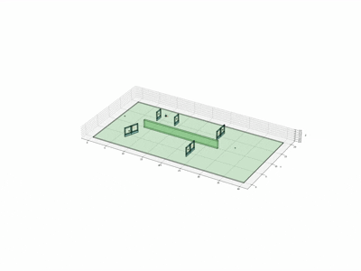
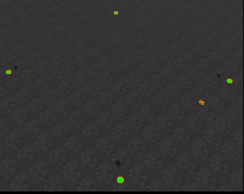
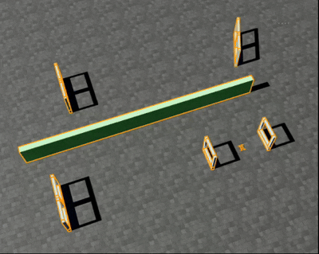

# DroneTracking

DroneTracking is a Pegasus/Isaac Sim based drone tracking and obstacle-avoidance
workspace. The current workflow targets Isaac Sim 5.1, PX4 1.16, ROS 2 Humble,
and the conda environment.

<p align="center">
  
  
  
</p>

## Requirements

- Isaac Sim 5.1 with Pegasus Simulator
- PX4 1.16 configured in the Pegasus extension
- ROS 2 Humble on Ubuntu 22.04
- `px4-ros_ws` overlay available through `tools/simdrone_env.sh`
- ROS 2 package: `px4_msgs`
- Optional: QGroundControl at `~/DroneSimulator/QGroundControl-x86_64.AppImage`

Load the project environment with:

```bash
cd ${Path2Project}/DroneTracking
source ./tools/simdrone_env.sh
```

## Config

Runtime options are loaded from YAML through `DRONE_TRACKING_CONFIG`.

```bash
export DRONE_TRACKING_CONFIG=config_0.yaml
export DRONE_TRACKING_CONFIG=config_1.yaml
export DRONE_TRACKING_CONFIG=config_oa.yaml
export DRONE_TRACKING_CONFIG=cfg_visual.yaml
export DRONE_TRACKING_CONFIG=cfg_lidar.yaml
```

Relative config names are resolved under `yamls/`; absolute paths also work. If
unset, `yamls/config_0.yaml` is used.

Built-in configs:

- `config_0.yaml`: default single-vehicle config
- `config_1.yaml`: namespaced `/px4_1/*` config
- `config_oa.yaml`: MPC obstacle-avoidance config

## Start Simulation

Recommended launcher:

```bash
cd ${Path2Project}/DroneTracking
./tools/simdrone_single.sh
```

It starts a tmux session with:

- `rviz2 -d tools/layout.rviz`
- `python isaacsim/tf_tree.py`
- `isaac_run isaacsim/sim_single.py`
- `MicroXRCEAgent udp4 -p 8888`
- QGroundControl

Manual startup:

```bash
cd ${Path2Project}/DroneTracking
source ./tools/simdrone_env.sh
isaac_run isaacsim/sim_single.py
MicroXRCEAgent udp4 -p 8888
./QGroundControl-x86_64.AppImage
```

Waypoint and scene selection:

```bash
isaac_run isaacsim/sim_single.py --list-tasks
isaac_run isaacsim/sim_single.py --list-scenes
isaac_run isaacsim/sim_single.py --task-index 0 --scene-index 0
```

`sim_single.py` loads waypoint files from `plan2track/waypoints/` and scene files
from `scenes/*.txt`. Selecting the `behavior1k` scene source loads a USD scene
from `scenes/behavior1k/` and samples a random spawn point from the occupancy
map; task selection is skipped for `behavior1k`.

Behavior1k examples:

```bash
isaac_run isaacsim/sim_single.py --scene-source behavior1k --list-scenes
isaac_run isaacsim/sim_single.py --scene-source behavior1k --scene-index 0
```

`tools/simdrone_single.sh` sources `tools/export_mtl.sh` before starting Isaac
Sim so behavior1k material paths are available.

## Start Controller

Tracking only:

```bash
cd ${Path2Project}/DroneTracking
./tools/run_code.sh
./tools/run_code.sh dronecnt cfg_visual.yaml
```

Obstacle-avoidance stack:

```bash
cd ${Path2Project}/DroneTracking
./tools/run_oa_code.sh
./tools/run_oa_code.sh dronecnt config_0.yaml
```

`run_code.sh` starts:

- `python plan2track/plan2track.py`
- `python -m fsm.fsm_main`
- `python -m fsm.fsm_interface`

`run_oa_code.sh` starts the same controller panes and additionally starts:

- `python perception/depth2scan.py`

Manual startup:

```bash
cd ${Path2Project}/DroneTracking
source ./tools/simdrone_env.sh
export DRONE_TRACKING_CONFIG=config_0.yaml

python plan2track/plan2track.py
python -m fsm.fsm_main
python -m fsm.fsm_interface
python perception/depth2scan.py --ros-args \
  -p depth_topic:=/depth \
  -p scan_topic:=/depth2scan/scan \
  -p points_topic:=/depth2scan/points \
  -p frame_id:=drone_fpv_camera \
  -p config_path:=$PWD/perception/yaml/depth_transform.yaml
```

## FSM Commands

Use `python -m fsm.fsm_interface` for interactive commands:

- `prepare`
- `takeoff`
- `execute`
- `return`
- `land`
- `abort`
- `help`
- `state`
- `quit`

## Planning Data

Waypoint files for tracking live under:

```text
plan2track/waypoints/
```

Minimum-snap task/control files live under:

```text
plan2track/tasks/
```

Generate waypoints with:

```bash
python plan2track/generate_waypoints.py
```

The selected waypoint file is configured by:

```yaml
plan2track:
  path:
    file: plan2track/waypoints/line_waypoint.txt
```

## Perception

`perception/depth2scan.py` converts a ROS depth image into:

- `sensor_msgs/LaserScan` on `/depth2scan/scan`
- `sensor_msgs/PointCloud2` on `/depth2scan/points`

The depth conversion config is:

```text
perception/yaml/depth_transform.yaml
```

Current assumptions:

- Isaac Sim depth image is `32FC1` in meters
- horizontal FOV is 90 deg
- scan bins are angular buckets over the camera horizontal FOV
- max-range points are published as `inf` in `LaserScan` and are ignored by the
  obstacle-avoidance controller

## Controllers

The runtime controller is selected by:

```yaml
runtime:
  controller: mpc
  solver: osqp
```

Supported controller families:

- `mpc`: OSQP tracking MPC
- `mpcc`: MPCC tracker

When `tracking.hocbf.enabled` is true and depth scan points are available, the
MPC path tracker adds HOCBF obstacle-avoidance constraints. Without valid depth
scan points, it behaves as the normal tracking MPC.

Relevant YAML sections:

- `runtime`: controller and solver selection
- `topics`: FSM, planning, tracking, PX4, and perception ROS topics
- `vehicle`: PX4 target system and offboard publication switch
- `fsm`: FSM logging, takeoff, and auto-land behavior parameters
- `plan2track`: waypoint file, loading mode, loop mode, fixed yaw, and initial yaw
- `tracking.mpc`: horizon, timestep, and reference speed
- `tracking.mpc.cost`: MPC cost weights
- `tracking.mpcc`: MPCC cost weights and progress limits
- `tracking.control_loop`: controller timer period
- `tracking.yaw`: yaw gain and yaw-rate limit
- `tracking.ctbr`: body-rate/thrust conversion parameters
- `tracking.accel_fusion`: acceleration smoothing
- `tracking.constraints`: MPC state/input bounds
- `tracking.hocbf`: camera offset, safety radius, gains, and slack weight

## Coordinate Notes

- Isaac Sim uses an ENU world frame.
- Waypoint text files are loaded as NED and converted to ENU by planning and
  simulation utilities.
- `origin_mode: fixed` keeps the waypoint-file origin fixed.
- `origin_mode: first_xy` shifts the path so the first waypoint has local
  `x/y = 0/0`.
- `fixed_yaw: true` publishes `init_yaw` as the yaw command.
- `fixed_yaw: false` publishes path-tangent yaw.

## Key Files

- `isaacsim/sim_single.py`: single-vehicle Isaac Sim app
- `isaacsim/sim_utils.py`: scene, waypoint marker, and behavior1k helpers
- `isaacsim/tf_tree.py`: ROS TF tree publisher
- `plan2track/plan2track.py`: waypoint/path bridge for MPC/MPCC tracking
- `plan2track/generate_waypoints.py`: minimum-snap waypoint generation helper
- `perception/depth2scan.py`: depth image to pseudo LaserScan converter
- `tracking/tracking_cnt.py`: controller step, CTBR conversion, and yaw-rate logic
- `tracking/tracking_osqp.py`: OSQP MPC/HOCBF solver implementation
<<<<<<< HEAD
- `tracking/tracking_ros.py`: PX4 ROS message bridge
=======
>>>>>>> 66427e1 (add obstacle avoidance)
- `fsm/fsm_main.py`: FSM node startup
- `fsm/fsm_node.py`: FSM ROS node and transition coordinator
- `fsm/fsm_mpc.py`: MPC/MPCC behavior and tracker command publication
- `fsm/fsm_interface.py`: interactive FSM terminal
- `yamls/config.py`: YAML config loader
- `yamls/*.yaml`: runtime configs
